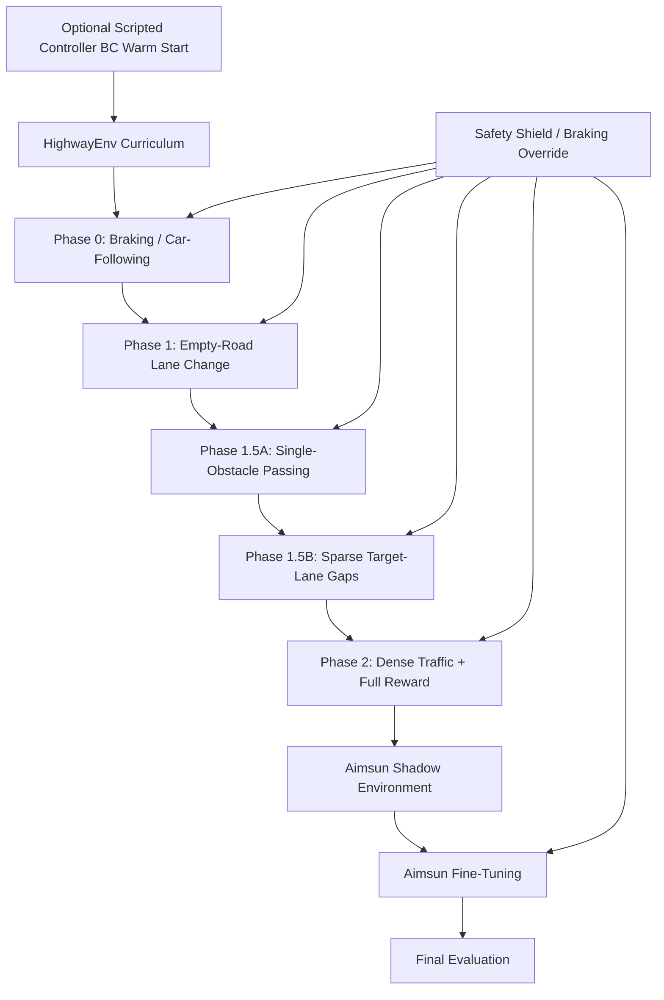

# PATH Lane-Change SAC Training Architecture

## Purpose

This document describes the proposed AI training pipeline for a SAC-based autonomous lane-changing agent. The goal is to first learn basic lane-change and safety behavior in HighwayEnv, then transfer the learned policy to Aimsun for higher-fidelity traffic behavior, merging dynamics, and final evaluation.

The immediate blocker is that the current Phase 1.5 HighwayEnv agent does not reliably learn braking. It often rear-ends slower vehicles or succeeds only through oscillatory/lucky lane-change behavior. The revised architecture separates subskills into a more gradual curriculum and adds guardrails around the hybrid continuous/discrete action design.

---

## Core Design Principle

Do not ask the agent to learn every driving behavior at once.

Instead of jumping from an empty highway directly to 10-car randomized traffic with all reward terms enabled, train the policy through isolated subskills:

```text
braking / car-following
→ empty-road lane-change completion
→ single-obstacle passing
→ sparse target-lane gap selection
→ dense HighwayEnv traffic
→ Aimsun fine-tuning and evaluation
```

The purpose of early stages is not realism. The purpose is to force the agent to acquire stable primitives before combining them.

---

## High-Level Pipeline



---

## Simulator Strategy

### HighwayEnv

HighwayEnv is used for cheap, fast behavioral learning. It is the main training environment for early curriculum stages.

HighwayEnv is responsible for:

- basic lane-change behavior
- braking and car-following
- safe passing around slower traffic
- target-lane gap selection
- dense traffic robustness
- reward debugging
- policy warm-start before Aimsun

### Aimsun

Aimsun is not used for from-scratch exploration because it is slower and runs at approximately 10 Hz. Instead, it is used for:

- fine-tuning the pretrained policy
- adapting to Aimsun vehicle physics and traffic behavior
- testing merging/lane-change interactions in more realistic traffic
- final evaluation and comparison

The policy should enter Aimsun already knowing basic driving behavior.

---

## Curriculum Phases

## Phase 0: Braking / Car-Following Only

### Goal

Teach the agent to brake instead of rear-ending a slower front vehicle.

### Environment

Use either:

```text
1 lane, 1 lead vehicle
```

or:

```text
2 lanes, but lane changes disabled or blocked
```

The key is that lateral escape should not be available. The agent must learn longitudinal control.

### Reward Terms

Enable only longitudinal safety and comfort terms:

```text
+ speed tracking / forward progress
- collision penalty
- TTC penalty
- unsafe headway penalty
- jerk / acceleration-change penalty
```

Do not include lane-change rewards in this phase.

### Success Criteria

The ego vehicle should survive the episode without collision while maintaining safe following distance and reasonable speed.

---

## Phase 1: Empty-Road Lane Change

### Goal

Teach the agent to complete a stable lane change without traffic.

### Environment

Use 2 lanes initially. Later randomize to 2-4 lanes once the basic behavior works.

### Reward Terms

Use simple lane-change completion reward:

```text
+ reward only when the vehicle reaches a new lane and remains stable for K timesteps
- penalty for collision, off-road behavior, or invalid lane-change attempt
- small penalty for oscillation / action-rate / jerk
```

Important: do not reward the lane-change command itself. Reward the completed stable outcome.

### Success Criteria

The ego vehicle changes lanes once, stabilizes in the new lane, and does not oscillate between lanes.

---

## Phase 1.5A: Single-Obstacle Passing

### Goal

Teach the agent to combine braking and lane changing.

### Environment

Use a slow lead vehicle in the ego lane. The adjacent lane should initially be open.

The desired behavior is:

```text
approach slower vehicle
→ slow down if needed
→ initiate lane change when safe
→ pass obstacle
→ stabilize in target lane
```

### Reward Terms

Enable:

```text
+ stable completed lane change around the obstacle
+ speed/progress reward
- collision penalty
- TTC/headway penalty
- jerk/action-rate penalty
- oscillation/reversal penalty
```

### Success Criteria

The ego vehicle should pass without rear-ending and without oscillating.

---

## Phase 1.5B: Sparse Target-Lane Gaps

### Goal

Teach gap acceptance and abort behavior.

### Environment

Use 2-3 lanes. Add target-lane front and rear vehicles. Traffic should be sparse and structured before being randomized.

The desired behavior is:

```text
check target-lane gap
→ change if safe
→ wait/brake if unsafe
→ abort if target gap collapses
```

### Reward Terms

Enable:

```text
+ completed safe lane change
+ speed/progress reward
- collision penalty
- TTC/headway penalty for current lane and target lane
- cut-in penalty if ego merges too close to target-lane rear vehicle
- jerk/action-rate penalty
- oscillation/reversal penalty
```

### Success Criteria

The ego vehicle should not force unsafe merges and should learn to wait or abort when the adjacent lane is unsafe.

---

## Phase 2: Dense HighwayEnv Traffic + Full Reward

### Goal

Train robust lane changing in randomized multi-vehicle traffic.

### Environment

Use randomized 2-4 lane HighwayEnv traffic with increasing vehicle count.

Suggested progression:

```text
5 vehicles → 10 vehicles → denser/randomized traffic
```

### Reward Terms

Enable full reward grouping:

```text
Safety:
    collision penalty
    TTC penalty
    unsafe headway penalty
    unsafe target-lane gap penalty

Progress:
    completed stable lane-change reward
    speed/progress reward
    task completion reward

Comfort:
    jerk penalty
    action-rate penalty
    lane-change reversal penalty
    oscillation penalty
```

### Success Criteria

The policy should safely complete lane changes in randomized traffic without relying on oscillatory behavior.

---

## Phase 3: Aimsun Fine-Tuning

### Goal

Adapt the HighwayEnv-trained policy to Aimsun vehicle dynamics, traffic behavior, and live integration constraints.

### Setup

Use the HighwayEnv-trained actor as initialization.

Recommended transfer strategy:

```text
keep actor weights
reset replay buffer
probably reset critics
lower learning rate
fine-tune on Aimsun-generated scenarios
```

Aimsun should not be the first place where the agent discovers braking or lane changing. It should be where the already-competent policy adapts.

---

## Action Space Design

The current design is a hybrid action space implemented through a continuous SAC actor.

Example actor output:

```text
action = [longitudinal_acceleration, lane_change_intent]
```

The lane-change component is continuous, but decoded into a discrete decision:

```text
intent < -threshold  → request left lane change
intent near 0        → keep lane
intent > threshold   → request right lane change
```

This can work, but it creates a hybrid control problem. The critic sees a continuous action, while the environment applies a thresholded discrete decision.

---

## Lane-Change Intent Decoder

## Problem

A simple threshold decoder can cause flickering:

```text
intent = 0.49 → keep lane
intent = 0.51 → change right
intent = 0.48 → keep lane
intent = 0.52 → change right
```

This can produce oscillatory behavior and bad critic learning.

## Solution: Hysteresis + Cooldown

Use separate thresholds for starting and stopping a lane-change command.

```python
START_THRESHOLD = 0.6
STOP_THRESHOLD = 0.3
```

Pseudo-logic:

```python
if mode == "keep_lane":
    if intent > START_THRESHOLD:
        mode = "changing_right"
    elif intent < -START_THRESHOLD:
        mode = "changing_left"

elif mode == "changing_right":
    if lane_change_finished or abs(intent) < STOP_THRESHOLD:
        mode = "keep_lane"

elif mode == "changing_left":
    if lane_change_finished or abs(intent) < STOP_THRESHOLD:
        mode = "keep_lane"
```

Add a lane-change cooldown:

```text
After initiating a lane change, ignore contradictory lane-change commands for K timesteps.
```

Example:

```text
policy_frequency = 10 Hz
cooldown = 20 timesteps = 2 seconds
```

---

## Markov State Requirement

Hysteresis introduces decoder memory. Therefore, the decoder state must be included in the observation. Otherwise the environment becomes partially observable to SAC.

Add these terms to the observation:

```python
obs_extra = [
    is_lane_changing,       # 0 or 1
    lane_change_direction,  # -1 left, 0 none, +1 right
    cooldown_remaining,     # normalized 0 to 1
    lane_change_progress,   # normalized 0 to 1 if available
    target_lane_delta       # target lane relative to current lane
]
```

Then the environment remains Markov from the policy's perspective.

---

## Safety Shield / Braking Override

Do not rely only on collision penalty to teach braking.

Add a longitudinal safety shield that overrides unsafe acceleration commands when a front collision is imminent.

Example pseudo-code:

```python
if front_vehicle_exists:
    gap = front.x - ego.x - vehicle_length
    closing_speed = ego.v - front.v

    if closing_speed > 0:
        ttc = gap / closing_speed
    else:
        ttc = float("inf")

    if gap < min_gap or ttc < ttc_threshold:
        action.acceleration = min(action.acceleration, hard_brake)
```

This is not meant to replace learning. It prevents obviously unsafe actions and lets SAC learn tactical behavior without constantly dying from basic longitudinal mistakes.

The safety shield should be logged separately so evaluation can report how often the learned policy required intervention.

Suggested logs:

```text
shield_intervention_count
shield_intervention_rate
min_ttc_before_intervention
acceleration_before_override
acceleration_after_override
```

---

## Reward Design Principles

## 1. Reward outcomes, not commands

Bad:

```text
+ reward when action says "change lane"
```

Better:

```text
+ reward when ego completes a lane change and remains stable for K timesteps
```

The agent should not be paid for requesting a lane change. It should be paid for completing a safe, stable maneuver.

## 2. Penalize oscillation explicitly

Add penalties for:

```text
rapid lane-change intent sign changes
repeated lane changes within a short window
left-right-left behavior
large action deltas
high jerk
```

Example:

```python
oscillation_penalty = -lambda_osc * abs(intent_t - intent_t_minus_1)
```

or stronger:

```python
if sign(intent_t) != sign(intent_t_minus_1) and abs(intent_t) > threshold:
    reward -= reversal_penalty
```

## 3. Make collision actually dominate

The collision penalty must dominate all easy positive reward collected before collision.

Track reward components separately:

```text
lane_change_reward
collision_penalty
ttc_penalty
jerk_penalty
speed_reward
oscillation_penalty
total_reward
```

If crashing after a few seconds still gives competitive return, the reward scale is wrong.

## 4. Use grouped reward logging

Log rewards by group:

```text
SafetyReward = collision + TTC + headway + target_gap
ProgressReward = lane_completion + speed + route_progress
ComfortReward = jerk + action_rate + oscillation
TotalReward = SafetyReward + ProgressReward + ComfortReward
```

This makes reward hacking easier to diagnose.

---

## Transfer Between Curriculum Phases

The actor and critic should not be treated the same.

## Actor

The actor contains useful behavior priors:

```text
brake behind slower vehicles
avoid high closing speed
initiate lane change when useful
avoid oscillation
```

Usually keep actor weights between phases.

## Critic

The critic estimates Q-values under a specific reward function, transition distribution, and task distribution. If the reward or scenario distribution changes heavily, the critic can become stale or misleading.

Recommended rule:

```text
small scenario change, same reward       → maybe keep critic
large scenario change or reward change   → reset critic
major phase boundary                     → reset replay buffer
```

At major phase boundaries:

```text
keep actor
reset replay buffer
strongly consider resetting critics
```

This prevents stale Bellman targets from old tasks from corrupting the new phase.

---

## Avoiding Forgetting

Do not train each phase as fully disjoint forever. After early isolated training, use rehearsal by mixing old scenario types into later phases.

Example schedule:

```text
Phase 0:
    100% braking

Phase 1:
    80% empty lane change
    20% braking

Phase 1.5A:
    80% single-obstacle passing
    10% braking
    10% empty lane change

Phase 1.5B:
    70% sparse target gaps
    20% single-obstacle passing
    10% braking

Phase 2:
    70% dense traffic
    20% sparse target gaps
    10% braking / single-obstacle passing
```

This helps prevent the policy from forgetting braking after learning lane changing.

---

## Optional Warm Start

A full imitation-learning pipeline is not required.

However, a lightweight warm start may help if SAC still fails to discover braking and non-oscillatory behavior.

## Scripted Controller Demonstrations

Generate demonstrations from a simple safe controller:

```text
if front TTC is low:
    brake
elif target lane is safe and lead vehicle is slow:
    initiate lane change
else:
    keep lane / maintain speed
```

Use this only to initialize the actor. Then train with SAC normally.

This avoids needing DAgger or human intervention. The demonstrator can be a scripted controller rather than a human expert.

## Role of Warm Start

Warm start is not the main research contribution. It is just a way to prevent early SAC exploration from being dominated by crashes and oscillations.

The main contribution remains:

```text
curriculum-trained SAC lane-change policy
+ safety-aware reward design
+ hybrid action decoder with Markov state
+ HighwayEnv-to-Aimsun fine-tuning pipeline
```

---

## Parallel Training

HighwayEnv training should be parallelized using vectorized environments.

Recommended approach with Stable-Baselines3:

```text
SubprocVecEnv with N parallel HighwayEnv instances
```

Use CPU multiprocessing. HighwayEnv stepping is mostly CPU-bound, so this is likely higher ROI than trying to use an Intel Arc GPU.

Practical recommendations:

```text
use device="cpu" unless CUDA/NVIDIA is available
set n_envs near but not above logical CPU cores
use highway-fast-v0 for early curriculum if acceptable
turn off rendering/video during training
lower eval/logging frequency
checkpoint after each phase
```

The Intel Arc GPU is probably not worth spending research time on for SB3. SB3 is straightforward with CPU or CUDA. HighwayEnv simulation itself is likely the bottleneck anyway.

---

## Aimsun Transfer Details

When transferring to Aimsun:

```text
load HighwayEnv-trained actor
reset replay buffer
probably reset critics
lower learning rate
use safety shield initially
log shield intervention rate
fine-tune on Aimsun scenarios
```

Aimsun-specific evaluation metrics:

```text
collision rate
lane-change success rate
minimum TTC
mean TTC
time headway
lane-change duration
jerk / acceleration smoothness
speed compliance
number of safety-shield interventions
merge-gap quality
```

Aimsun should be used for final adaptation and evaluation, not for discovering basic lane-change behavior from scratch.

---

## Suggested Implementation Modules

```text
training/
    train_curriculum.py
    phase_config.py
    callbacks.py

envs/
    highway_curriculum_env.py
    reward_terms.py
    observation_builder.py
    action_decoder.py
    safety_shield.py
    scenario_sampler.py

policies/
    sac_policy.py
    bc_warm_start.py

transfer/
    export_policy.py
    aimsun_shadow_env.py
    aimsun_finetune.py

logging/
    reward_logger.py
    safety_metrics.py
    tensorboard_utils.py
```

---

## Minimum Next Steps

1. Add a braking-only curriculum phase.
2. Disable or block lane changes during braking-only training.
3. Change lane-change reward to completed stable lane change only.
4. Add hysteresis and cooldown to the lane-change intent decoder.
5. Add decoder state to the observation.
6. Add oscillation/reversal penalties.
7. Add a longitudinal safety shield and log interventions.
8. Reset replay buffer at major phase boundaries.
9. Keep actor weights between phases; reset critics when reward/scenario changes significantly.
10. Use SubprocVecEnv to parallelize HighwayEnv training.
11. Transfer the trained actor to Aimsun for fine-tuning/evaluation.

---

## Open Questions for Implementation Review

1. What exact continuous action vector should SAC output?
2. Should lane-change intent be one scalar or two independent logits/intents for left and right?
3. What should the cooldown duration be at the current policy frequency?
4. What observation features currently exist, and where should decoder state be appended?
5. Should the safety shield override acceleration only, or also block unsafe lane-change initiation?
6. What reward scales make collision dominate all pre-crash positive reward?
7. At which phase boundaries should critics be reset?
8. Should BC warm start be implemented now, or only after curriculum + shield are tested?
9. How should Aimsun scenarios be sampled to match the HighwayEnv curriculum distribution?
10. What metrics define readiness to transfer from HighwayEnv to Aimsun?
